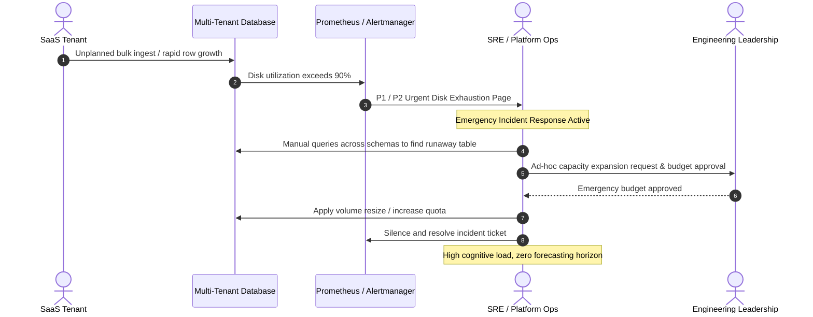
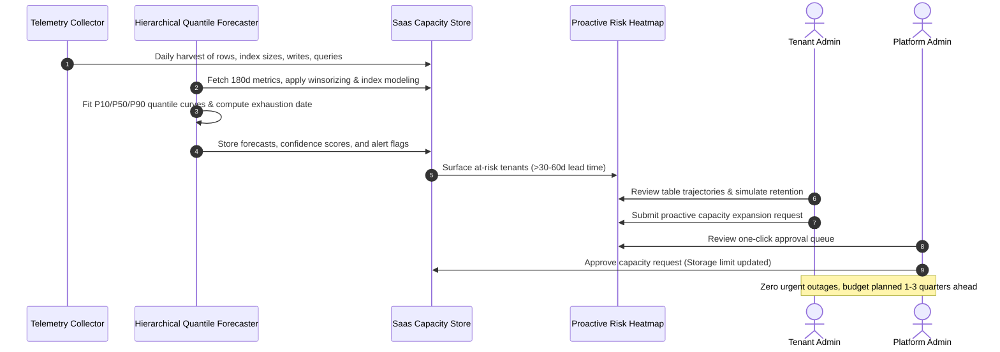

# Operational Workflow & Field-Workflow Map: Reactive vs Proactive Capacity Management

This document contrasts the legacy reactive capacity workflow with the modern, tenant-aware proactive forecasting workflow and details the end-to-end data field mapping across every operational stage and user role.

---

## 1. High-Level Process Comparison

### 1.1 Legacy Reactive Process (Past State)
In the legacy model, capacity was monitored at the cluster/volume level or through static 90% disk utilization alerts. Because tenants operate separate schemas with unpredictable ingestion rhythms, alerts fired with minimal lead time (often <48 hours), forcing emergency engineering interventions.

### 1.2 Proposed Proactive Process (Current System)
In the proposed proactive model, operational telemetry (rows, writes, queries, table size, index size) is extracted daily into a feature store. A hierarchical quantile forecaster computes P10, P50, and P90 exhaustion horizons at the schema, table, and index levels, surfacing exhaustion dates 30 to 90 days in advance.

---

## 2. End-to-End Field-Workflow Map

The table below traces every operational and analytical data field through each phase of the lifecycle:

| Telemetry / Input Field | Ingestion & Storage Entity | Model Feature Role | Forecast Output Entity | UI Display & Role Visibility |
|:---|:---|:---|:---|:---|
| `metric_date` | `daily_metrics.metric_date` | Time-series index & 70/30 split boundary | `forecasts.forecast_date` | Timeline X-axis on all forecast charts |
| `tenant_id` | `tenants.tenant_id` | Partition key & hierarchical root | `forecasts.tenant_id` | Tenant selector & RBAC authorization boundary |
| `org_id` | `tenants.org_id` | Multi-tenant organization scoping | Filter criterion | Scope filter for `tenant_admin` |
| `tier` | `tenants.tier` | Categorical prior for cold-start defaults | Prior weight in fallback | Tenant metadata badge in Heatmap & View |
| `table_id` | `tables.table_id` | Table-level regression target | `table_forecasts.table_id` | Detailed table breakdown table |
| `row_bytes` | `tables.row_bytes` | Conversion factor (rows $\to$ GB) | Storage projection multiplier | Retention ceiling calculation |
| `retention_days` | `retention_rules.retention_days`| Asymptotic ceiling parameter | Scenario override flag | "What-If" Retention Simulator slider |
| `index_factor` | `indexes.index_factor` | Index bloat detection signal | Bloat flag & index forecast | Table vs Index size breakdown |
| `rows` | `daily_metrics.rows` | Volume level & 7d/30d momentum | Table growth driver | Cumulative volume trajectory |
| `table_size_gb` | `daily_metrics.table_size_gb` | Primary regression target variable | `current_size_gb` | Metric card & Y-axis storage curve |
| `index_size_gb` | `daily_metrics.index_size_gb` | Secondary regression target | `projected_size_30d_gb` | Table breakdown and bloat alerts |
| `writes` | `daily_metrics.writes` | Activity momentum & churn proxy | Velocity feature | Operational telemetry indicator |
| `queries` | `daily_metrics.queries` | Read-write ratio & caching efficiency | Workload profile feature | Workload profiling |
| `storage_limit_gb` | `storage_limits.limit_gb` | Threshold boundary for exhaustion date | Exhaustion date intersection | Red dashed ceiling line on Altair charts |

---

## 3. Workflow & Permission Visibility Changes by Role

The implementation enforces strict separation of concerns across four key organizational personas:

```mermaid
graph TD
    subgraph Platform Admin
        PA1[View Global Risk Heatmap] --> PA2[Review All 50 Tenants Across 5 Orgs]
        PA2 --> PA3[Approve / Reject Capacity Requests]
        PA3 --> PA4[Modify Global Quotas & Retention Rules]
        PA4 --> PA5[Trigger Batch Model Retraining]
    end

    subgraph Tenant Admin
        TA1[Filter by Own Organization] --> TA2[Inspect Table & Index Projections]
        TA2 --> TA3[Simulate Retention Horizon What-Ifs]
        TA3 --> TA4[Submit Proactive Capacity Expansion Requests]
    end

    subgraph External Partner
        EP1[Access Scoped to Delegated Tenants] --> EP2[Read-Only Inspection of Storage Trends]
        EP2 --> EP3[No Mutation / No Approval Rights]
    end

    subgraph Auditor
        AU1[Access Backtest Benchmark Suite] --> AU2[Inspect Residuals & Prediction Coverage]
        AU2 --> AU3[Review Immutable Security Audit Logs]
        AU3 --> AU4[No Schema or Raw Tenant Table Access]
    end
```

### Role Visibility Breakdown Matrix

1. **Platform Admin (`platform_admin`)**:
   - **Visible Scopes**: Unrestricted cross-tenant visibility across all 50 tenant schemas and 5 organizations.
   - **Key Views**: Global Heatmap (Critical $\le$ 14d, Warning 15–30d, Stable $>30$d), Capacity Approval Queue, Full Tenant Drilldown.
   - **Permitted Actions**: Approve/Reject capacity requests, update storage quotas, create retention rules, trigger batch forecast runs.

2. **Tenant Admin (`tenant_admin`)**:
   - **Visible Scopes**: Restricted strictly to tenant schemas mapped to their authenticated `org_id` (e.g. `org_1`). Attempting to query foreign tenants returns HTTP 403 Forbidden.
   - **Key Views**: Tenant Forecaster, Table/Index Breakdown, Capacity Request Status.
   - **Permitted Actions**: Submit proactive capacity expansion requests, interact with "What-If" retention sliders. Cannot approve capacity or edit quotas directly.

3. **External Partner (`external_partner`)**:
   - **Visible Scopes**: Scoped strictly to explicitly delegated partner tenant schemas (e.g. `tenant_041` through `tenant_045`).
   - **Key Views**: Partner Delegated Tenants dashboard with simplified metrics and green trend curves.
   - **Permitted Actions**: Read-only inspection. Cannot access internal system tables, approval queues, or modify configurations.

4. **Compliance Auditor (`auditor`)**:
   - **Visible Scopes**: System-level benchmark statistics and immutable security audit logs.
   - **Key Views**: Backtest Benchmark comparison table, residual plots, audit log table.
   - **Permitted Actions**: Read-only verification. Cannot access customer table data, raw schemas, or administrative mutation APIs.
